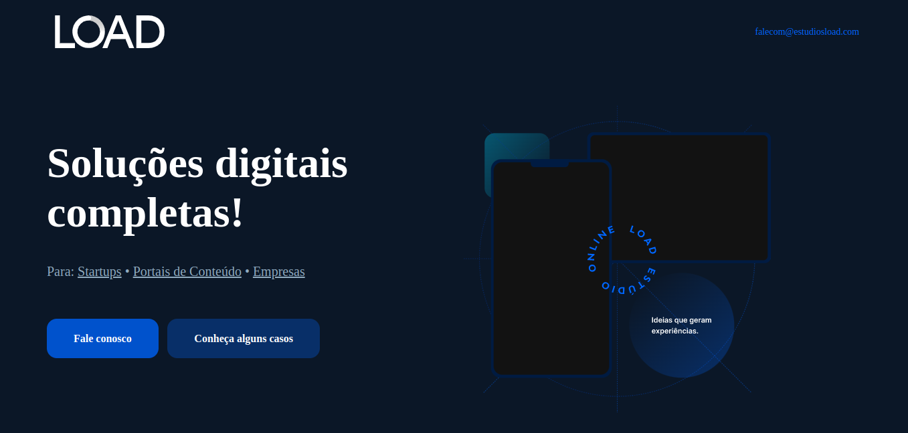

# Estudio LOAD
Projeto desenvolvido no processo seletivo da Estudio LOAD. Neste projeto, foram utilizadas as tecnologias _Sass_ e _Bootstrap_ assim como recomendado, sendo esse o resultado final:

## Diferenciais

Além de ter utilizado as tecnologias recomendadas (_Bootstrap e Sass_), este projeto também contém uma pequena animação nas imagens ao carregar a página. Porém, é importante resaltar que essa animação não foi testada em todos os tamanhos de tela, somente no meu computador pessoal, portanto pode não ficar adequado à todos os tipos de tela.

## Requerimentos para executar o projeto

Para executar esse projeto é preciso ter o _node_ instalado para baixar as dependências do projeto contendo o _Bootstrap_:

> npm install

Depois, é preciso instalar o _Sass_ (de preferência de forma global):

> npm install sass -g

Então, é possível compilar o _Sass_ com o comando:

> npm run scss

Por fim, é só abrir o _index.html_ normalmente no navegador.